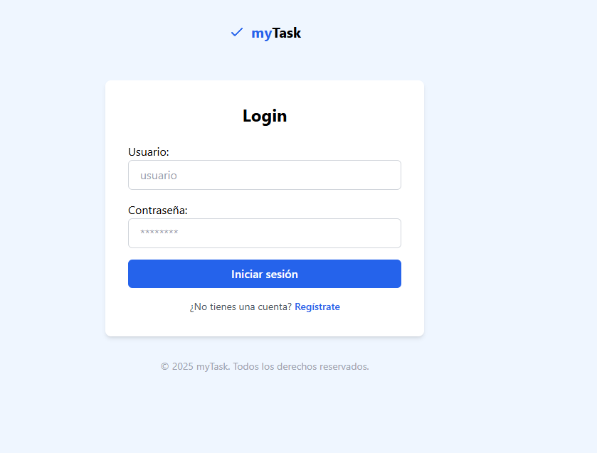

# 📋 myTask - Gestor de Tareas con Django

Un sistema moderno de gestión de tareas desarrollado con Django y diseñado con una interfaz limpia y amigable. Permite a los usuarios organizar sus tareas diarias de manera eficiente con funcionalidades de marcado, desmarcado y seguimiento de completado.

## 🎯 Características Destacadas

### 🔐 Sistema de Autenticación

- Interfaz de login intuitiva
- Registro de nuevos usuarios
- Protección de rutas
- Gestión de sesiones segura

### 📝 Gestión de Tareas

- Crear tareas con título y descripción
- Marcar tareas como importantes
- Marcar/Desmarcar tareas como completadas
- Registro automático de fecha de completado
- Edición y eliminación de tareas
- Vista de lista organizada

### 🎨 Interfaz de Usuario
- Diseño moderno y minimalista
- Feedback visual para acciones
- Responsive design
- Navegación intuitiva
- Botones de acción claros y accesibles

## 🛠️ Tecnologías

- **Backend**: Django 5.2
- **Frontend**: 
  - HTML5
  - Tailwind CSS
  - JavaScript
- **Base de Datos**: SQLite3
- **Autenticación**: Django Auth
- **Forms**: Django Forms + Widget Tweaks

## 📦 Instalación

1. **Clonar el repositorio**
```bash
git clone https://github.com/yarlinson/CRUD-GESTIONDETAREAS-DJANGO.git
cd CRUD-GESTIONDETAREAS-DJANGO
```

2. **Crear entorno virtual**
```bash
python -m venv venv

# Windows
venv\Scripts\activate

# Linux/macOS
source venv/bin/activate
```

3. **Instalar dependencias**
```bash
pip install -r requirements.txt
```

4. **Configurar la base de datos**
```bash
python manage.py migrate
```

5. **Crear superusuario (opcional)**
```bash
python manage.py createsuperuser
```

6. **Iniciar el servidor**
```bash
python manage.py runserver
```

## 📱 Uso

1. **Registro/Login**
   - Accede a la página de inicio
   - Crea una nueva cuenta o inicia sesión
   - Los datos se validan automáticamente

2. **Gestión de Tareas**
   - Crea nuevas tareas desde el formulario principal
   - Marca las tareas como importantes según prioridad
   - Usa el checkbox para marcar/desmarcar como completadas
   - Edita o elimina tareas según necesites

3. **Seguimiento**
   - Visualiza la fecha de completado de las tareas
   - Filtra entre tareas pendientes y completadas
   - Mantén un registro de tu progreso

## 🔄 Funcionalidades Implementadas

### Vistas Principales
- `home`: Dashboard principal
- `login_view`: Autenticación de usuarios
- `create_Task`: Creación y listado de tareas
- `task_complete`: Toggle de estado completado
- `task_delete`: Eliminación de tareas

### Modelo de Datos
```python
class Task(models.Model):
    title = models.CharField(max_length=200)
    description = models.CharField(blank=True)
    created = models.DateTimeField(auto_now_add=True)
    datecompleted = models.DateTimeField(null=True, blank=True)
    important = models.BooleanField(default=False)
    user = models.ForeignKey(User, on_delete=models.CASCADE)
```

## 🤝 Contribuir

1. Fork el repositorio
2. Crea una rama para tu feature (`git checkout -b feature/AmazingFeature`)
3. Commit tus cambios (`git commit -m 'Add: Nueva característica'`)
4. Push a la rama (`git push origin feature/AmazingFeature`)
5. Abre un Pull Request

## 📄 Licencia

Distribuido bajo la Licencia MIT. Ver `LICENSE` para más información.

## 👤 Autor

Yarlinson Tiberio Barranco Bastilla
